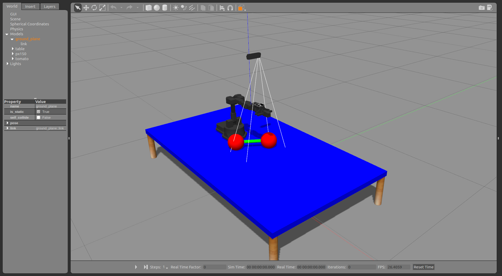
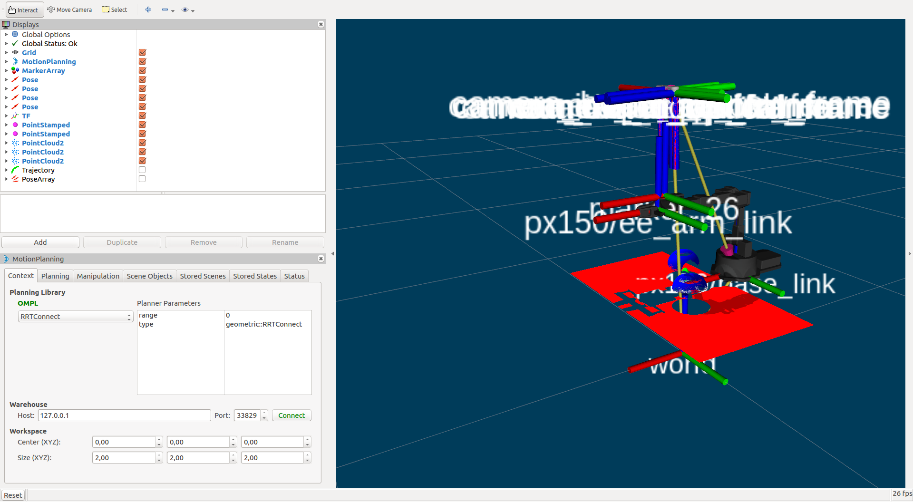

# iiwa_grasp

Ubuntu: 16.04 LTS
ROS: kinetic

## Contents

### ROS package

- **flex_gazebo**: Gazebo simulation contains camera and marker

- **flex_gazebo_iiwa**: Gazebo simulation for the iiwa

- **flex_gazebo_interbotix**: Gazebo simulation for the interbotix manipulator

- **flex_grasp** :  Manipulator control to grasp food objects. Contains all the ROS nodes.

- **flex_sdh_moveit**: SDH files required for control via MoveIt!

- **rqt_user_interface**: graphical user interface

### Others

- **detect_truss**: Computer vision pipeline for Python (ROS independent)


## Install

### Dependencies


#### detect_truss

- [skan](https://jni.github.io/skan/): Used for skeleton anlysis. Skan is only available for python 3, but no ROS distribution officially supports Python 3. Some hacks exists, but I did not feel like trying this, being afraid it might brake other things. Therefore I decided to make some modifications to skan such that it works with python 2, these can be found on [this branch](https://github.com/TaekedeHaan/skan/tree/python-2.7). For me everything seemed to work, but if you find a way you can use python 3 please use the original library

#### flex_grasp

- [interbotix_ros_arms](https://github.com/Interbotix/interbotix_ros_arms): for Interbotix support. To be able to reset DYNAMIXEL motors after an error occured, I added an additional rebood service which is automaticaaly called when a motor reports an Harware Error. These can be found on [this branch](https://github.com/TaekedeHaan/interbotix_ros_arms/tree/reboot_service). Note that the used repository is now in legacy mode, the [updated sdk](https://github.com/Interbotix/interbotix_ros_core) contains this reboot serive by default.

- [iiwa_stack](https://github.com/IFL-CAMP/iiwa_stack): for iiwa support.

- [easy_handeye](https://github.com/IFL-CAMP/easy_handeye): for hand eye calibration

- [realsense-ros](https://github.com/IntelRealSense/realsense-ros): for realsense camera support

#### rqt_user_interface

- [rqt_ez_publisher](http://wiki.ros.org/rqt_ez_publisher): for easily subscribing and changing the computer vision pipline parameters. To initialize the parameters in the GUI to the values last published, I made some modifications to the library these can be found on [this branch](https://github.com/TaekedeHaan/rqt_ez_publisher/tree/initialize-subscribe). Note that you can also use the default library, howver this initialization makes life a bit easier.

### Setup
1.  Clone the master branch:
```
	git clone https://gitlab.tudelft.nl/pvkulkarni/flexcraft_jelle.git
```


### Run (Simulation)
1. To run in simulation we first launch the enviroment. To launch the interbotix enviroment run in your terminal:
    ```
    roslaunch flex_grasp interbotix_enviroment.launch
    ```

2. Gazebo should start by default it is paused (this behaviour can be chnaged in the launch files).

    

3. Unpause the simulation by hitting play on the bar shown at the bottom, RViz should start
    
    
    
4. You have succesfully started the enviroment. To stat the controls run in your terminal:
    ```
    roslaunch flex_grasp interbotix_control.launch
    ``` 
5. An rqt graphical user interface should pop up, sometimes in initializes incorrect, if this happens hit Ctrl + C, and retry

    

6. You have succesfully initialized the controls, and the virtual robot is ready to go.


### Run (Real Hardware)
1. Again, first launch the enviroment. To launch the interbotix enviroment for real hardware run in your terminal:
    ```
    roslaunch flex_grasp interbotix_enviroment.launch camera_sim:=false robot_sim:=false
    ```
    Here we use the parameters to toggle between Gazebo simulation and real hardware:
    - camera_sim: simulate the camera (default: true)
    - robot_sim: simulate the manipulator (default: true)
    
2. You have succesfully started the enviroment. To stat the controls run in your terminal:
    ```
    roslaunch flex_grasp interbotix_control.launch
    ``` 
3. An rqt graphical user interface should pop up, sometimes in initializes incorrect, if this happens hit Ctrl + C, and retry

4. You have succesfully initialized the controls, and the robot is ready to go.

### Command (Virtual) Robot
To activate an action, a command needs to be published on the `ROBOT_NAME/pipeline_command`. This can be done using the GUI:
- Sleep: command the manipulator to the resting pose
- Home: command the manipulator to the upright pose
- Ready: command the robot to the initial pose
- Open: command the end effector to open
- Close: command the end effector to close
- Calibrate: determine the pose between the robot base and camera
- Detect Truss: command to computer vision pipeline to detect the truss
- Save Image: sace the current image
- Pick and Plance: execute a pick and place routing
- Experiment: Repeatedly execute Detect Truss, Save Image and Pick and Place (easy for conducitng experiments)

With the drup down menu you can select where to store the results.


## Supported hardware

Manipulator:

- **Interbotix PincherX 150** (possibly all others from the interbotix series, but this has not been tested)
- **KUKA LBR IIWA 7** (deprecated in simulation + not tested on actual hardware)

End-effector:

- **SDH** (deprecated in simulation + not tested on actual hardware)

Carmera:

- **Intel RealSense D435**
