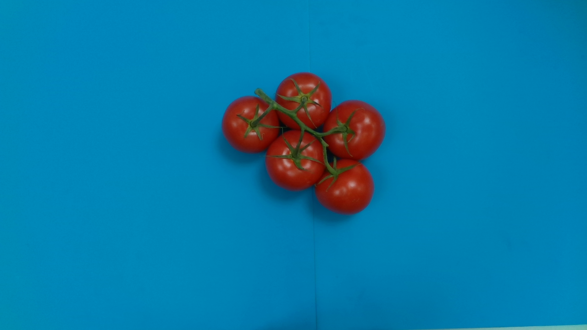
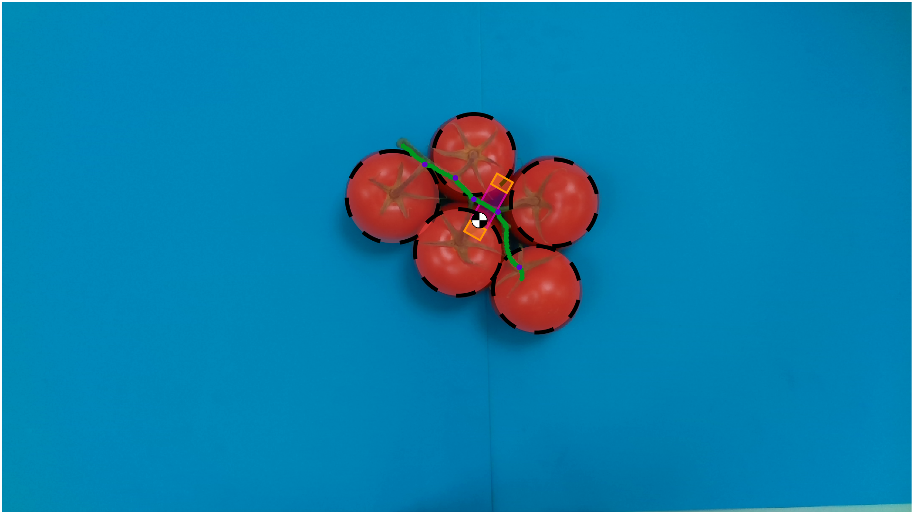
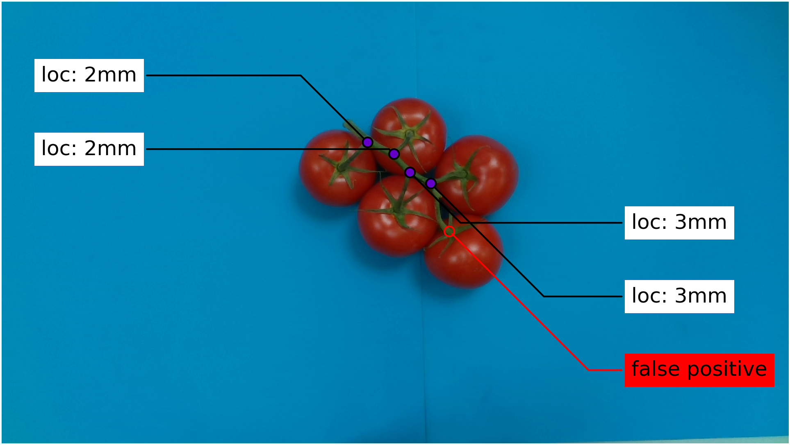
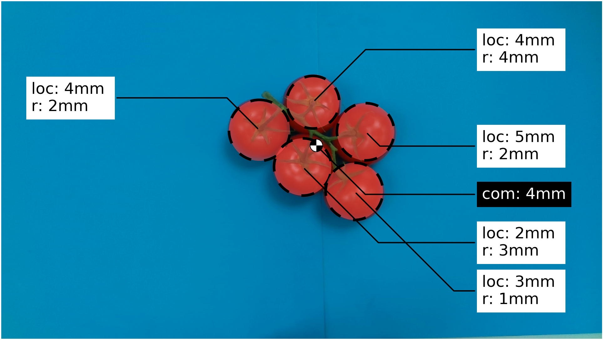

# Detect truss 

## Dependeincies
python 2.7: No ROS distribution officially supports Python 3, thus python 2 is used such that the code works in combination with ROS.

skan: Used for skeleton anlysis. Skan is only available for python 3, Therefore I decided to make some modifications to skan such that it works with python 2, these can be found on [this](https://github.com/TaekedeHaan/skan/tree/python-2.7) branch.

## Genral introduction
This python package extracts truss features from a given image and determined an optimal grasping pose:






Moreover, if you provide a ground truth, an error may be determined:




## Code structure
Currently, this repository is fairly unstructured, I will improve this. For now:

1. The main file for feature extraction and grasp pose determination is [detect_truss/ProcessImage.py](src/detect_truss/ProcessImage.py)
2. The main file for comparing these results with the ground truth is [detect_truss/analyze_results.py](src/detect_truss/analyze_results.py)

There are some additional files, first of these files profide functions used in ProcessImage.py
- [compute_grasp](src/detect_truss/compute_grasp.py): contains parameters used form computing the grasp location
- [detect_peduncle_2](src/detect_truss/detect_peduncle_2.py): contains parameters and functions for peducnle detection, NOTE: detect_peduncle.py is not used
- [detect_tomato](src/detect_truss/detect_tomato.py): contains parameters and functions for tomato detection
- [filter_segments](src/detect_truss/filter_segments.py): contains parameters and functions for filering segments
- [segment_image](src/detect_truss/segment_image.py): contains parameters and functions for image segmentation

There are two helper modules:
- [geometry](src/detect_truss/geometry.py): this module contains the Point2D and Transform class, these are used to track 2d points in images with respect to different reference frames. This is usefull for ProcessImage.py since the actual image processing is done on a rotated and translated reference frame.
- [imgpy](src/detect_truss/imgpy.py): this module contains the Image class, this is used for easy rotating and cropping of images, also used in ProcessImage.py

There are some tests:
- [test](src/detect_truss/test.py) contains proper tests for the geometry module. It certainly does not cover all possible scenaro but its a good start.
- [test_rotate_image](src/test_rotate_image.py) contains a visual check for the geometry module.
- [tesy](src/test) contains some files for running certain parts of the computer vision pipeline.

Finally there are several utilities for opening files, plotting, etc.:
-


## conventions

All image coordinates are stated as (x,y) as this is also the default for open cn and matplot lib. This means that for numpy these coordinates need to be swapped to get (row, column). 


## Data

### Process image
ProcessImage requires the following data per image:

1. An rgb image called [id].png
2. A [id]_info.json file containing the field px_per_mm which describes the number of pixels per millimeter present at the truss level

The files used for the theis can be found here (add link).

ProcessImage will generate a prediction file .json file called [id].json, in the results/dataset/json folder. This file contains information about the predicted tomatoes, peduncle and grasp locations.

### analyze_results
Analyze results requires the folowing data:

1. A ground truth [id].json file containing the actual features
2. A prediction [id].json gile containing the predicted predicted features


## Issues

# cv2 setup


See [here](https://stackoverflow.com/questions/63346648/python-2-7-installing-opencv-via-pip-virtual-environment)
Python 2.7 is not supported anymore in opencv-python-4.3.0.38 the support was dropped since 4.3.0.36, see this issue.

The workaround I found was to install opencv-python version 4.2.0.32 (which is the latest supported for Python 2.7, see this for all releases) like this:

```
pip2 install opencv-python==4.2.0.32
```
