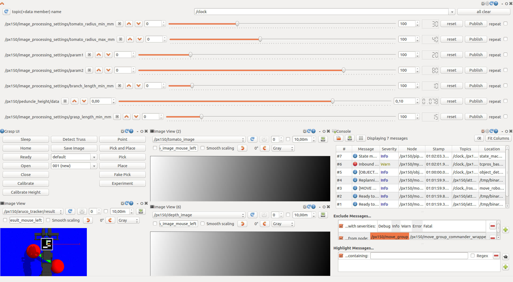

# Flex Grasp
A ROS packages for manipulating vine tomato.

## 1. Install
> :warning: This has only been tested on Ubuntu 16.04 (ros kinetic) and Ubuntu 18.04 (ros melodic)!


### 1.1 Install ROS
Install ROS [Melodic](http://wiki.ros.org/melodic/Installation) (Ubuntu 18.04) or [Kinetic](http://wiki.ros.org/kinetic/Installation) (Ubuntu 16.04). Make sure sure that you have your environment properly setup, and that you have the most up to date packages:
```
rosdep update  # No sudo
sudo apt-get update
sudo apt-get dist-upgrade
```

### 1.2 Create A Workspace
You will need to have a ROS workspace setup:
```
mkdir -p ~/flexcraft_ws/src
cd ~/flexcraft_ws/
catkin_make
```

### 1.3 Download the source code
> :warning: Only use the master branch!

clone this repository
```
cd ~/flexcraft_ws/src
git clone https://github.com/padmaja-kulkarni/taeke_msc.git
```

### 1.4 Basic Dependencies
Some more packages need to be installed manually.

#### Interbotix Support
For Interbotix support we require interbotix_ros_arms:
```
cd ~/flexcraft_ws/src
git clone --single-branch --branch reboot_service https://github.com/TaekedeHaan/interbotix_ros_arms.git
```
This forked repository has an additional reboot service which is automatically called when a motor reports an Harware Error. Note that the used repository is now in legacy mode, the [updated SDK](https://github.com/Interbotix/interbotix_ros_core) contains this reboot serive by default. However, I never tested the rest of the code with the update SDK. We need to install one dependency manually:
```
python -m pip install modern_robotics
```
Finally set up the udev rules for communication:
```
$ sudo cp ~/flexcraft_ws/src/interbotix_ros_arms/interbotix_sdk/10-interbotix-udev.rules /etc/udev/rules.d
$ sudo udevadm control --reload-rules && udevadm trigger
```
When running into any problems please refere to the [interbotix_ros_arms repo](https://github.com/Interbotix/interbotix_ros_arms)

#### iiwa Support
For iiwa support we require the iiwa_stack:
```
cd ~/flexcraft_ws/src
git clone https://github.com/IFL-CAMP/iiwa_stack
```

#### Calibration
For calibration easy_handeye is used:
```
cd ~/flexcraft_ws/src
git clone https://github.com/IFL-CAMP/easy_handeye.git
```

#### Intel Realsense
For Intel Realsense support realsense-ros and realsense2_description are used. Install these packages and dependencies as explained [here](https://github.com/IntelRealSense/realsense-ros). First define your ROS version, for example:
```
export ROS_VER=melodic
```
Than install both realsense2_camera and its dependents, including librealsense2 library:

```
sudo apt-get install ros-$ROS_VER-realsense2-camera
```
Finally install the realsense2_description:

```
sudo apt-get install ros-$ROS_VER-realsense2-description
```
It includes the 3D-models of the devices and is necessary for running launch files that include these models (i.e. rs_d435_camera_with_model.launch).

> :warning: In case you run into issues with the camera install the SDK as explained [here](https://www.intelrealsense.com/sdk-2/) and select Linux.

#### Graphical User Interface
For fine-tuning parameters of the computer vision pipeline rqt_ez_publisher is used:
```
cd ~/flexcraft_ws/src
git clone --single-branch --branch initialize-subscribe https://github.com/TaekedeHaan/rqt_ez_publisher.git
```
This forks contains some modifications to initialize the parameters in the GUI to the values last published. Note that you can also use the default library. However, this initialization makes life a bit easier.

#### Python packages
Not all packages could be specified in the package.xml, and need to be installled manually:
```
python2 -m pip install colormath
```
The flex_vision package relies on a fork of the skan library wich offers python 2 support:
```
python2 -m pip install git+https://github.com/TaekedeHaan/skan.git@python-2.7
```


### 1.5 Remaining Dependencies
Install remaining dependencies:
```
cd ~/flexcraft_ws
rosdep install --from-paths src --ignore-src -r -y
```

## 2 Run (Simulation)
1. To run in simulation we first launch the enviroment. To launch the interbotix enviroment run in your terminal:
    ```
    roslaunch flex_grasp interbotix_enviroment.launch use_calibration:=false
    ```
    There is no calibration file available yet, therefore we put `use_calibration` to `false`.

2. Gazebo should start by default it is paused (this behaviour can be chnaged in the launch files).

    

3. Unpause the simulation by hitting play on the bar shown at the bottom, RViz should start

    

4. You have succesfully started the enviroment. To stat the controls run in your terminal:
    ```
    roslaunch flex_grasp interbotix_control.launch
    ```
5. An rqt graphical user interface should pop up, sometimes in initializes incorrect, if this happens hit Ctrl + C, and retry

    

6. You have succesfully initialized the controls, and the virtual robot is ready to go.

### Calibrate
First we need to calibrate the robot, this will generate a yaml file, which is stored and can be reused. Simply press `calibrate` in the GUI. The manipulator should move to several poses successively. It should print something as follows in the terminal:

```
[INFO] [1606135222.288133, 1573.747000]: State machine transitioning 'Idle':'calibrate'-->'CalibrateRobot'
[INFO] [1606135228.279287, 1579.025000]: Taking a sample...
[INFO] [1606135228.405969, 1579.128000]: Got a sample
[INFO] [1606135233.904765, 1583.933000]: Taking a sample...
[INFO] [1606135234.128548, 1584.135000]: Got a sample
...
[INFO] [1606135269.247164, 1615.083000]: Computing from 8 poses...
[INFO] [1606135269.295404, 1615.128000]: Computed calibration: effector_camera:
  translation:
    x: -0.028680958287
    y: 0.0123665209654
    z: 0.572588152978
  rotation:
    x: 0.174461585153
    y: 0.615597501442
    z: 0.158824096836
    w: 0.751916070974

```
The calibration results can be found in ~/.ros/easy_handeye/calibration_eye_on_base.yaml. Now you can stop the current porces by pressing `Ctrl + C`. Now run
```
roslaunch flex_grasp interbotix_enviroment.launch
```
And the previously generated calibration file will be loaded automatically.

### Run (Real Hardware)
1. Again, first launch the environment. To launch the interbotix environment for real hardware run in your terminal:
    ```
    roslaunch flex_grasp interbotix_enviroment.launch camera_sim:=false robot_sim:=false
    ```
    Here we use the parameters to toggle between Gazebo simulation and real hardware:
    - camera_sim: simulate the camera (default: true)
    - robot_sim: simulate the manipulator (default: true)

2. You have successfully started the environment. To stat the controls run in your terminal:
    ```
    roslaunch flex_grasp interbotix_control.launch
    ```
3. An rqt graphical user interface should pop up, sometimes in initializes incorrect, if this happens hit Ctrl + C, and retry

4. You have successfully initialized the controls, and the robot is ready to go.

Note: if you get warnings that the end effector is not able to reach its targets upon closing you may consider redefining the Closed interbotix_gripper group state as stated in `/interbotix_ros_arms/interbotix_moveit/config/srdf/px150.srdf.xacro`. I am using values of 0.017 and -0.017 due to the additional finger tips.

### Command (Virtual) Robot
To activate an action, a command needs to be published on the `ROBOT_NAME/pipeline_command`. This can be done using the GUI:
- Sleep: command the manipulator to the resting pose
- Home: command the manipulator to the upright pose
- Ready: command the robot to the initial pose
- Open: command the end effector to open
- Close: command the end effector to close
- Calibrate: determine the pose between the robot base and camera
- Detect Truss: command to computer vision pipeline to detect the truss
- Save Image: save the current image
- Pick and Place: execute a pick and place routing
- Experiment: Repeatedly execute Detect Truss, Save Image and Pick and Place (easy for conducitng experiments)

With the drop down menu you can select where to store the results.


## 3 Supported hardware

Manipulator:

- **Interbotix PincherX 150** (possibly all others from the interbotix series, but this has not been tested)
- **KUKA LBR IIWA 7** (deprecated in simulation + not tested on actual hardware)

End-effector:

- **SDH** (deprecated in simulation + not tested on actual hardware)

Carmera:

- **Intel RealSense D435**


## 4 Contents

### Nodes

- `analyze_point_cloud`: not used
- `calibrate`: generates the calibration poses, sends them to the move robot node and computing calibration
- `monitor robot`: is used to monitor the DYNAMIXELS of the interbotix robot, by reading temperature and error values. Furthermore it sets the PID values upon startup as defined in `/config/px150_pid`. This node does not do anything in simulation
- `move_gripper`: not used
- `move_robot`: takes commands from other nodes and moves the manipulater according to these commands
- `object_detection`: uses detect_truss to identify a valid grasp location
- `pick_place`: generates pick place commands and sends these to move_robot
- `pipeline`: contains the statemachine, commands all other nodes
- `transform_pose`: transforms a grasping pose as calculated by object_detection to a target pose for the manipulator
- `visualize_object`: not used

### Classes
- `communication`: this class is used by many nodes to send commands to other nodes and wait for the result

### Messages
- `ImageProcessingSettings`
- `Peduncle`
- `Tomato`
- `Truss`


### Enums
To store the state of different parts of the system, enums are used. These are defined in the messa files.
- `DynamixelErrorCodes`
- `FlexGraspCommandCodes`
- `FlexGraspErrorCodes`

### Info

All nodes run in the `robot_name` namespace to allow for multiple robots present

## 5 Trouble shooting

### libcurl: (51) SSL: no alternative certificate subject name matches target host name ‘api.ignitionfuel.org’
https://varhowto.com/how-to-fix-libcurl-51-ssl-no-alternative-certificate-subject-name-matches-target-host-name-api-ignitionfuel-org-gazebo-ubuntu-ros-melodic/

### RLException: unused args [start_sampling_gui] for include of [/home/taeke/flexcraft_ws/src/easy_handeye/easy_handeye/launch/calibrate.launch]
In older version of `calibrate.launch` the variable `start_sampling_gui` was called `start_rqt`. Thus to fix this command either update easy_handeye, of if this is not desired change `start_sampling_gui` in taeke_msc/flex_grasp/launch to `start_rqt`.

### Calibration node does not initialize, but gets stuck
If calibrate gets stuck at:
```
[INFO] [1610553811.946348, 0.001000]: Loading parameters for calibration /px150/calibration_eye_on_base/ from the parameters server
```
check this issue: https://github.com/IFL-CAMP/easy_handeye/issues/77
